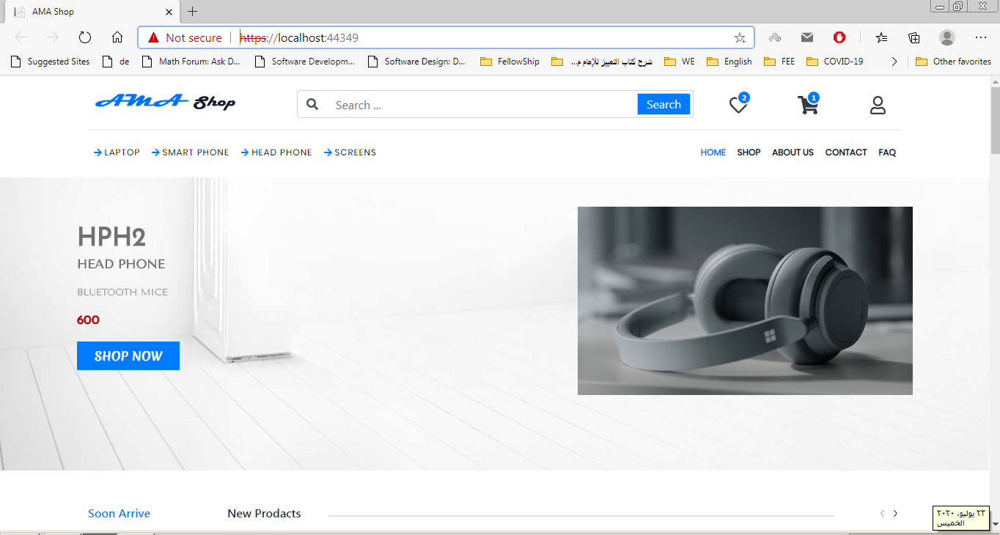
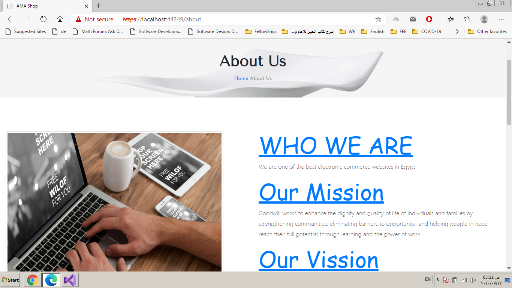
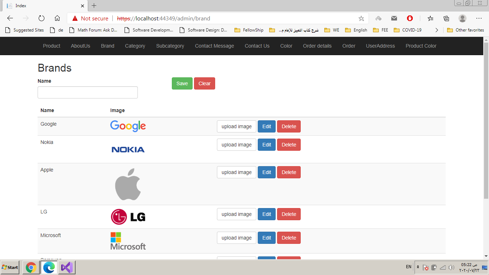
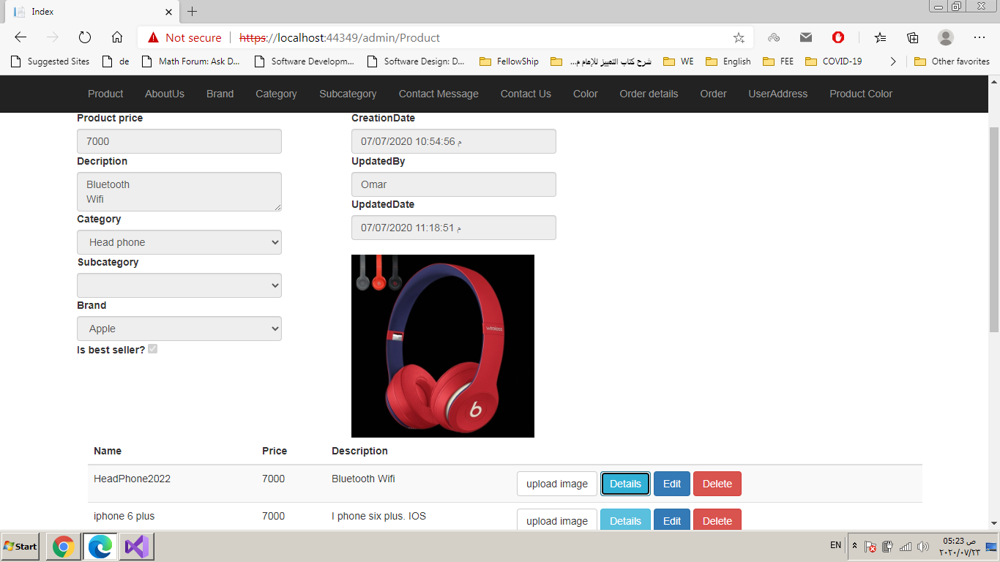
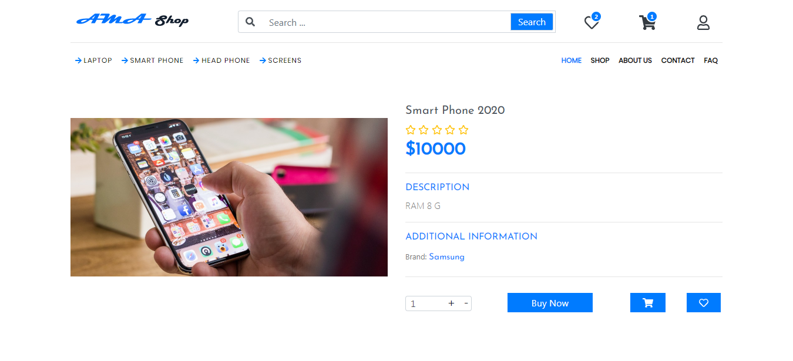
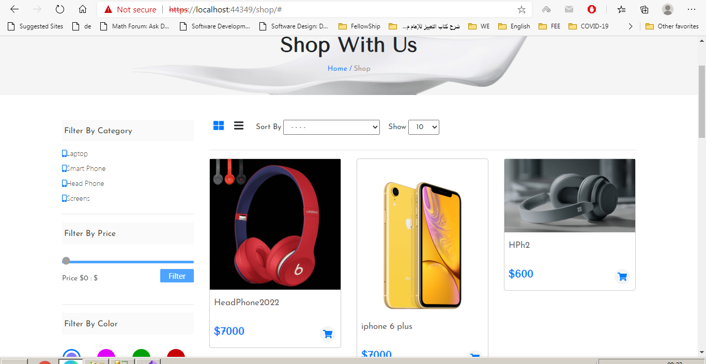
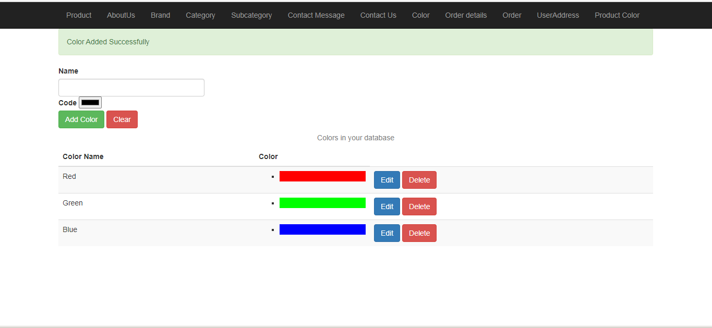
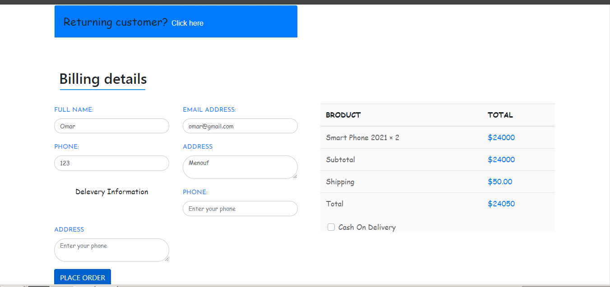
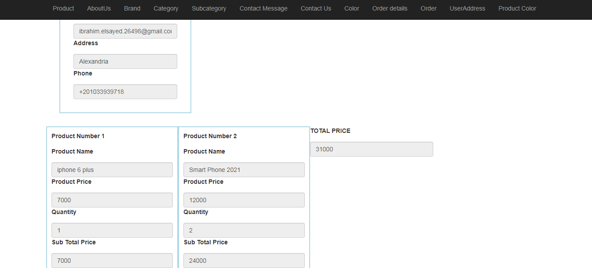

# Ecommerce Website(ASP.NET MVC. SQL server)
It contains two types of users (Admin, Customer).
- **The admin** is the website owner (or a repersentive of him).
- **The admin** can use the website to represent the products
and manage the website.

- **The customer** could have an account on the website,
he could go throw the websites and add products to
cart and and order the products.

# How to try this website?
If you want to try using this website, you need to
have SQL server management sudio (at least 2014),
and Visual studio which support ASP.NET MVC.

* Run "EcommerceProject.sql" file on SQL server
* The database must named as "EcommerceProject".
* Run the Project in the VS, and make sure that
  the database is connected to the project.
* Also, you need to have a browser,
  prefered (chrome, firefox or opera).
 
 
 
# Notes
- **The project has not been finished yet**
- **"EcommerceProject.sql"** file is updataed every database update,
    so make sure to run the file on the database to get the updated.

# Project Snapshots

